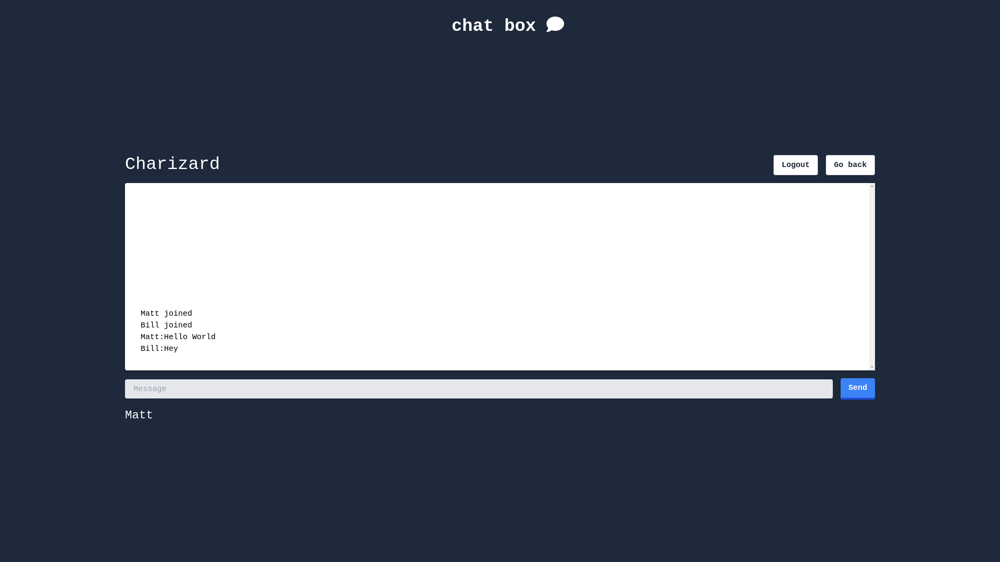
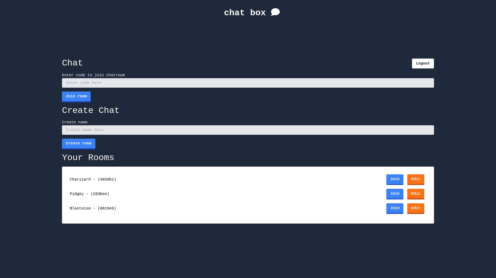
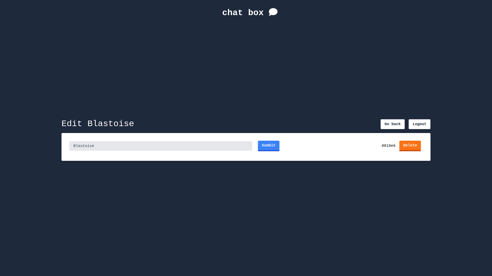

# Chat Box

A CRUD application built using Node.js, Express, Socket.io, Passport, Bcrypt, and MongoDB that allows users to create and manage chat rooms.

## Features

- Create an account with authentication using Passport and Bcrypt
- Create a chat room with a unique code
- Join a chat room using the unique code
- Edit and delete chat rooms
- User authentication with Passport and Bcrypt
- Real-time communication using Socket.io
- Data storage with MongoDB

## How to use

1.  Create an account by clicking on the "Make an account" button.
2.  Log in to your account.
3.  Create a chat room by entering a room name and clicking on the "Create Room" button.
4.  Share the unique code with others to allow them to join the chat room.
5.  Edit or delete a room by clicking on the "Edit" in the "Your Rooms" section.

### Deployment

In progress...

## Technologies used

- [Node.js](https://nodejs.org/en/) - JavaScript runtime
- [Express](https://expressjs.com/) - Web framework for Node.js
- [Socket.io](https://socket.io/) - Real-time communication library
- [Passport](http://www.passportjs.org/) - Authentication middleware for Node.js
- [Bcrypt](https://github.com/kelektiv/node.bcrypt.js/) - Library for hashing passwords
- [MongoDB](https://www.mongodb.com/) - NoSQL document database
- [JSX](https://reactjs.org/docs/introducing-jsx.html) - Syntax extension for React

## Next Steps

- Implement React Webhooks to add interactivity to messages, such as liking, deleting, and replying to messages.
- Add private messaging functionality for one-on-one communication between users.

## Screenshots

## Authors

- **Matthew Kolden** - _Initial work_ - [matthewkolden](https://github.com/matthewkolden)
